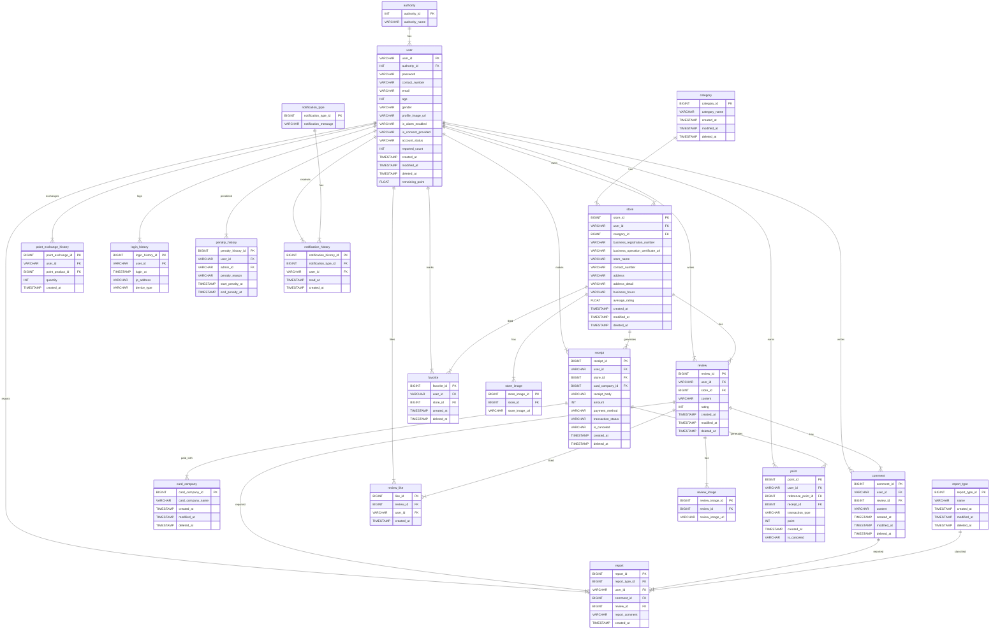
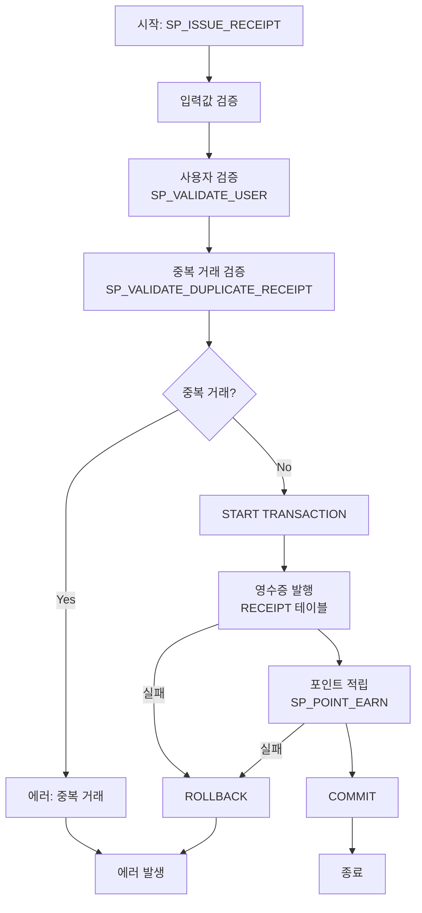
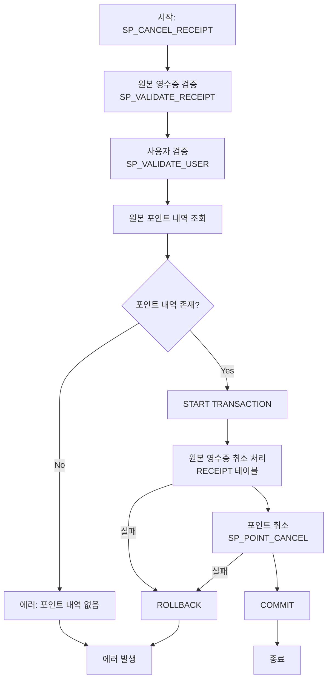

<div align="center">


<h1>개발자를 위한 커뮤니티가 여러분을 찾아갑니다</h1>
<h3>개발 능력 업그레이드를 DevPath와 함께!</h3>

</div>
<br><br>
<h1>🔍 목차</h1>

<table>
  <tr>
    <td>
      <details open>
        <summary><b>1. We are FreePath 👋</b></summary>
        <ul>
          <li><a href="#team">Team FreePath 🪄</a></li>
          <li><a href="#project">Our Project 📹</a></li>
        </ul>
      </details>
    </td>
  </tr>
  <tr>
    <td>
      <details open>
        <summary><b>2. Project Result 🗂️</b></summary>
        <ul>
          <li><a href="#wbs">WBS 📝</a></li>
          <li><a href="#gantt">Gantt Chart 📊</a></li>
          <li><a href="#requirements">요구사항 명세서 📣</a></li>
          <li><a href="#erd">논리/물리 ERD 📋</a></li>
          <li><a href="#restapi">REST API 설계 문서 ✔️</a></li>
          <li><a href="#msa">MSA 아키텍쳐 구조도 📌</a></li>
          <li><a href="#test">테스트 결과 보고서 🎖️</a></li>
        </ul>
      </details>
    </td>
  </tr>
  <tr>
    <td>
      <details open>
        <summary><b>3. Our Notion Page 🗂️</b></summary>
        <ul>
          <li><a href="#ournotionpage">Notion Page Link 📓</a></li>
        </ul>
      </details>
    </td>
  </tr>
</table>

<br>

## <span id="team">🪄 Team FreePath</span>

<div align="center">

|                                **김운경**                                |                                **김태인**                                |                                **이기연**                                |
| :----------------------------------------------------------------------: | :----------------------------------------------------------------------: | :----------------------------------------------------------------------: |
|  |  |  |
|                [@splguyjr](https://github.com/splguyjr)                |              [@Taein5415](https://github.com/Taein5415)                  |                  [@Lee-gi-yeun](https://github.com/Lee-gi-yeun)                  |

|                                **이주미**                                |                               **이채은**                               |                                **하채린**                                |
| :----------------------------------------------------------------------: |:-------------------------------------------------------------------:| :----------------------------------------------------------------------: |
|  |  |  |
|                 [@z00m-1n](https://github.com/z00m-1n)                 |              [@nineeko](https://github.com/nineeko)               |                   [@didiha](https://github.com/didiha)                   | 

</div>

<br><br>

## <span id="project">📹 Our Project</span>

### <span id="tech-stack">💻 기술 스택</span>

<div>
  
  
  
    
<br>
  
  
  
<br>
  
  
  
  
</div>

<br><br>

<h5>프로젝트 목적</h5>
프로젝트 <b>DevPath</b>는 비전공자와 주니어 개발자들이 실전 준비 과정에서 겪는 단절을 해소하고자 합니다. 구조화된 피드백과 동료와의 협업, 성장 추적 기능을 통해 지속적인 성장을 지원합니다. 이를 통해 단편적인 정보 소비를 넘어 자기 주도적 학습과 회고가 가능한 환경을 제공합니다.
<br><br>
<details>
<summary>프로젝트 구조</summary>

```angular2html
com.devpath
├── common
│   ├── auth
│   │   ├── controller
│   │   ├── dto
│   │   ├── entity
│   │   └── service
│   ├── config
│   ├── jwt
│   └── response
│
├── config
│
├── exception
│   └── (예외 처리 클래스들)
│
├── user # Users 
│   ├── command
│   └── query
│
├── itnews # ITNews
│   ├── command
│   └── query
│ 
├── chatting # Chatting, ChattingJoin, ChattingRoom, UserBlock
│   ├── command
│   └── query
│
├── board
│   ├── post # Board, BoardCategory, Attachment
│   │   ├── command
│   │   └── query
│   │   
│   ├── comment # Comment
│   │   ├── command
│   │   └── query
│   │   
│   ├── vote # Vote, VoteItem, VoteHistory
│   │   ├── command
│   │   └── query
│   │   
│   └── interaction # Like, BoardBookmark
│       ├── command
│       └── query
│
├── interview # Interview, InterviewRoom
│   ├── command
│   └── query
│
├── report # Report, ReportCheck
│   ├── command
│   └── query
│
└── csquiz # CsQuiz, CsQuizResult, CsQuizOption
    ├── command
    └── query

```
</details>
<br>

<h1 id="project-result">🗂️ 프로젝트 산출물</h1>

<h3 id="wbs">📝 WBS (Work Breakdown Structure)</h3>
<details>
    <summary><b>WBS 상세보기</b></summary>
    <div markdown="1">
        
        <br>
        <a href="https://www.notion.so/WBS-1972fdb1414880e5927bfca57c78818e" target="_blank">
            <b>🔗 WBS 상세 문서 보기</b>
        </a>
    </div>
</details>

<h3 id="gantt">📊 Gantt Chart</h3>
<details>
    <summary><b>Gantt Chart 상세보기</b></summary>
    <div markdown="1">
        
    </div>
</details>

<h3 id="requirements">📣 요구사항 명세서</h3>
<details>
    <summary><b>요구사항 명세서 상세보기</b></summary>
    <div markdown="1">
        
    </div>
</details>

<h3 id="table-spec">📋 테이블 명세서</h3>

<details>
    <summary><b>테이블 명세서 상세보기</b></summary>
    <div markdown="1">
        
    </div>
</details>

<h3 id="usecase">👤 Usecase</h3>
<details>
    <summary>Usecase 자세히 보기</summary>
    <div markdown="1">
            
    </div>
</details>

<h3 id="erd">📌 ERD</h3>
<details>
    <summary>ERD Cloud 자세히 보기</summary>
    <div markdown="1">
        
    </div>
</details>



<i><center><u>mermaid로 표현한 ERD</u></center></i>

<h3 id="process-flow">🎖️ 핵심 로직 플로우차트</h3>

<h4>1. 영수증 발행 프로세스</h4>
프로시저 세부 다이어그램은 <code>./src/mobile-receipt/point/</code> 경로의 다어어그램 참조
<br><br>



<h4>2. 영수증 취소 프로세스</h4>
프로시저 세부 다이어그램은 <code>./src/mobile-receipt/point/</code> 경로의 다어어그램 참조
<br><br>



<br>

<h3 id="test-cases">🧪 테스트 케이스</h3>

<h4>일반 테스트</h4>
<details>
    <summary><b>고객 유형 분석 테스트 상세보기</b></summary>
    <div markdown="1">
            
    </div>
</details>

<details>
    <summary><b>매장 매출 분석 테스트 상세보기</b></summary>
    <div markdown="1">
            
    </div>
</details>

<details>
    <summary><b>베스트 리뷰 선정 테스트 상세보기</b></summary>
    <div markdown="1">
            
    </div>
</details>

<details>
    <summary><b>베스트 리뷰 알림 테스트 상세보기</b></summary>
    <div markdown="1">
            
    </div>
</details>

<details>
    <summary><b>시간대별 분석 테스트 상세보기</b></summary>
    <div markdown="1">
            
    </div>
</details>

<details>
    <summary><b>영수증 발행 알림 테스트 상세보기</b></summary>
    <div markdown="1">
            
    </div>
</details>

<details>
    <summary><b>요일별 분석 테스트 상세보기</b></summary>
    <div markdown="1">
            
    </div>
</details>

<h4>영수증 관련 테스트</h4>
<details>
    <summary><b>초기 데이터 확인 및 프로시저 등록 확인 테스트 상세보기</b></summary>
    <div markdown="1">
            
    </div>
</details>

<details>
    <summary><b>영수증 발행 및 포인트 적립 테스트 상세보기</b></summary>
    <div markdown="1">
            
    </div>
</details>

<details>
    <summary><b>포인트 물품 교환(사용) 테스트 상세보기</b></summary>
    <div markdown="1">
            
    </div>
</details>

<details>
    <summary><b>영수증 취소 및 포인트 적립 취소 테스트 상세보기</b></summary>
    <div markdown="1">
            
    </div>
</details>

<details>
    <summary><b>에러 테스트 - 잔여 포인트 초과 물품 구매 시도 상세보기</b></summary>
    <div markdown="1">
            
    </div>
</details>

<details>
    <summary><b>에러 테스트 - 재고 초과 수량 구매 시도 상세보기</b></summary>
    <div markdown="1">
            
    </div>
</details>

<details>
    <summary><b>에러 테스트 - 이미 취소된 영수증 취소 재시도 상세보기</b></summary>
    <div markdown="1">
            
    </div>
</details>

<details>
    <summary><b>에러 테스트 - 10초 이내 중복 결제 시도 상세보기</b></summary>
    <div markdown="1">
            
    </div>
</details>

<details>
    <summary><b>결과 데이터 확인 테스트 상세보기</b></summary>
    <div markdown="1">
            
    </div>
</details>
<details>
    <summary><b>레플리케이션 서버 테스트 상세보기</b></summary>
    <div markdown="1">
            
    </div>
</details>

<br>
<br>
<h1 id="Our-Playground">🗂️ Our Playground</h1>
<a href="https://www.notion.so/be15_1st_Project_DB-5c52900ed26b42ad812641a28fe85249"><text><strong>| 📓 Notion Page Link |</text></strong></a><br><br>


<center><i>매일 아침 8시 40분에 진행하는 Scrum Meeting</i></center>


